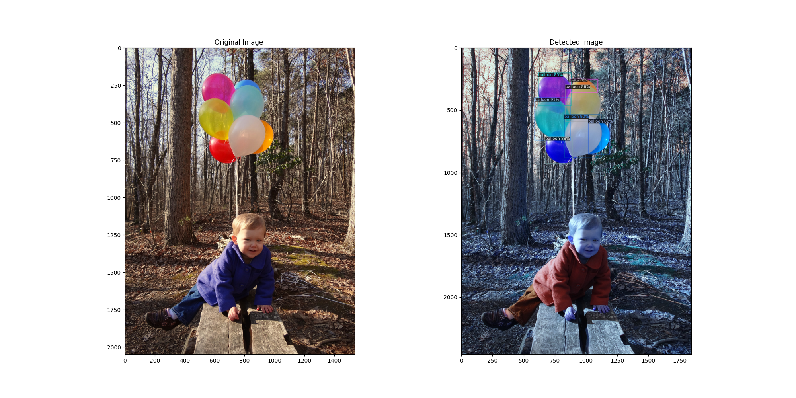
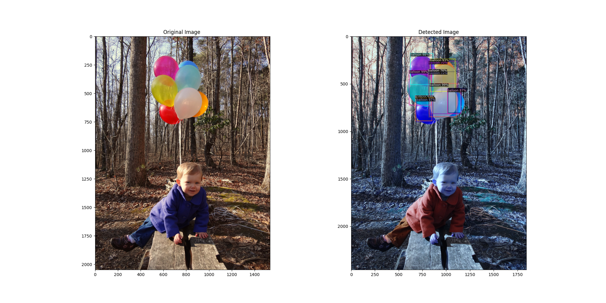

# Object Detection with Trasformer Using Detectron2

## Dependencies
  1. Install detectron2. (Prefer to use Conda version).
  2. Install DyHead by following the steps present in [DynamicHead](https://github.com/microsoft/DynamicHead).

     You may face some building issue related to CUDA in DynamicHead/dyhead/csrc/cuda/{deform_conv_cuda.cu, SigmoidFocalLoss_cuda.cu}.
     Try to Fix them.Otherwise,let me know what is the error you are facing.

## Dataset Preparation
  Balloon dataset is converted to COCO format & is present inside custom_balloon folder.

  If you want to convert balloon dataset in to coco format & use it in Detectron2.Then,
  follow the below steps.

    -   Download the balloon dataset from https://github.com/matterport/Mask_RCNN/releases/download/v2.1/balloon_dataset.zip.
    -   git clone https://github.com/woctezuma/VIA2COCO
    -   cd VIA2COCO/
        git checkout fixes
    -   run convert_coco.py

## Usage

### Enviornment Setup
-   For DyHead:
    1. Download weights(for example, dyhead_r50_atss_fpn_1x.pth) from [DynamicHead](https://github.com/microsoft/DynamicHead) & keep them inside pretrained_model/
    2. Copy the config files from  & keep them inside configs/

-   For DETR:
    1. git clone https://github.com/facebookresearch/detr/tree/master/d2.
    2. Keep the converted_model.pth inside pretrained_model/ 
       Here is the steps to get the converted_model.pth
           - python converter.py --source_model https://dl.fbaipublicfiles.com/detr/detr-r50-e632da11.pth --output_model converted_model.pth
    3. Copy the config file https://github.com/facebookresearch/detr/tree/master/d2/configs/detr_256_6_6_torchvision.yaml & keep it inside configs/ 

### Training
- For DyHead with FPN backbone:

      python3.8 training.py --outdir [where model will be saved] --arch dyhead-fpn --config [file path] --weight [file path] --epochs [no of epochs].

      For Example,
          python3.8 training.py --outdir out_dyhead_fpn/ --arch dyhead-fpn --config configs/dyhead_r50_atss_fpn_1x.yaml --weight pretrained_model/dyhead_r50_atss_fpn_1x.pth --epochs 5000

- For DyHead with Swin-T transformer backbone:

      python3.8 training.py --outdir [where model will be saved] --arch dyhead-swint --config [file path] --weight [file path] --epochs [no of epochs]

      For Example,
          python3.8 training.py --outdir out_dyhead_swint/ --arch dyhead-swint --config configs/dyhead_swint_atss_fpn_2x_ms.yaml --weight pretrained_model/dyhead_swint_atss_fpn_2x_ms.pth --epochs 5000.

- For DETR:

      python3.8 training.py --outdir [where model will be saved] --arch detr --config [file path] --weight [file path] --epochs [no of epochs].

      For Example,
          python3.8 training.py --outdir out_test/ --arch detr --config configs/detr_256_6_6_torchvision.yaml --weight pretrained_model/converted_model.pth --epochs 5000

### Inference:

- For DyHead with FPN backbone:

    python3.8 inference.py --outdir out_dyhead_fpn/ --arch dyhead-fpn --config configs/dyhead_r50_atss_fpn_1x.yaml --save True.

    Inference Time:
    
       Evaluation Time : {} ms  108.9015007019043
       Evaluation Time : {} ms  103.93381118774414
 
    

- For DyHead with Swin-T transformer backbone:
   python3.8 inference.py --outdir out_dyhead_swint/ --arch dyhead-swint --config configs/dyhead_swint_atss_fpn_2x_ms.yaml --save True.

   Inference Time:
      Evaluation Time : {} ms  157.5005054473877.
      Evaluation Time : {} ms  153.02109718322754
   
- For DETR:

    python3.8 inference.py --outdir out_detr/ --arch detr --config configs/detr_256_6_6_torchvision.yaml --save True.

    Inference Time:

        Evaluation Time : {} ms  71.02847099304199
        Evaluation Time : {} ms  92.53978729248047
 

## Conclusion:
As you can see from output, DETR is slighly faster than DyHead.However,DETR is not that accurate as DyHead in predicting all the ballons.

Please check the above output.

We can try other DyHead configs such as dyhead_swint_atss_fpn_2x_ms.yaml and check the output.

Here the idea is to demonstrate how to use trasformer based object detection using Detectron2 framework.
Please feel free to share your feedback.

## References:

- https://github.com/facebookresearch/detr/tree/master/d2.
- https://github.com/microsoft/DynamicHead.

---
Reach me @

[LinkedIn](https://www.linkedin.com/in/satya1507/) [GitHub](https://github.com/satya15july) [Medium](https://medium.com/@satya15july_11937)

