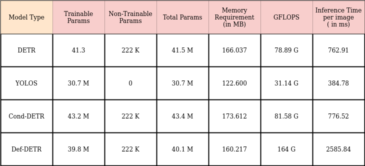
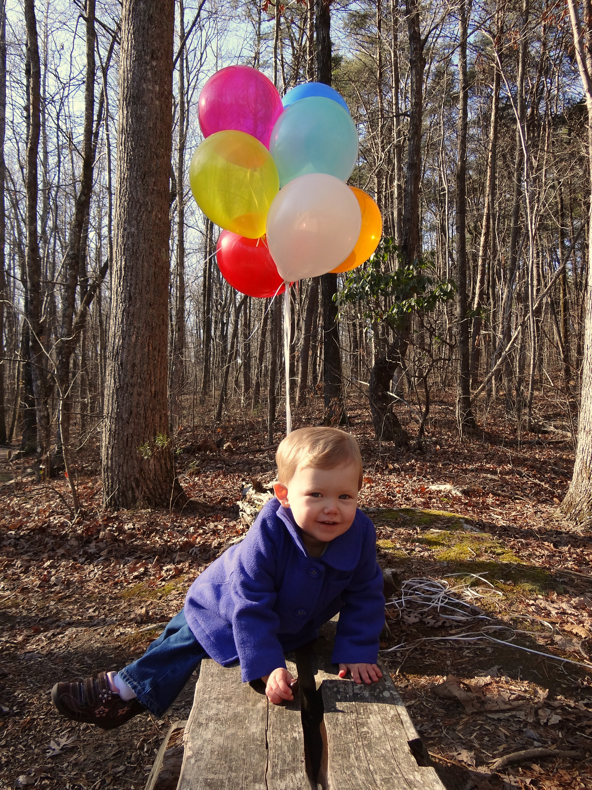
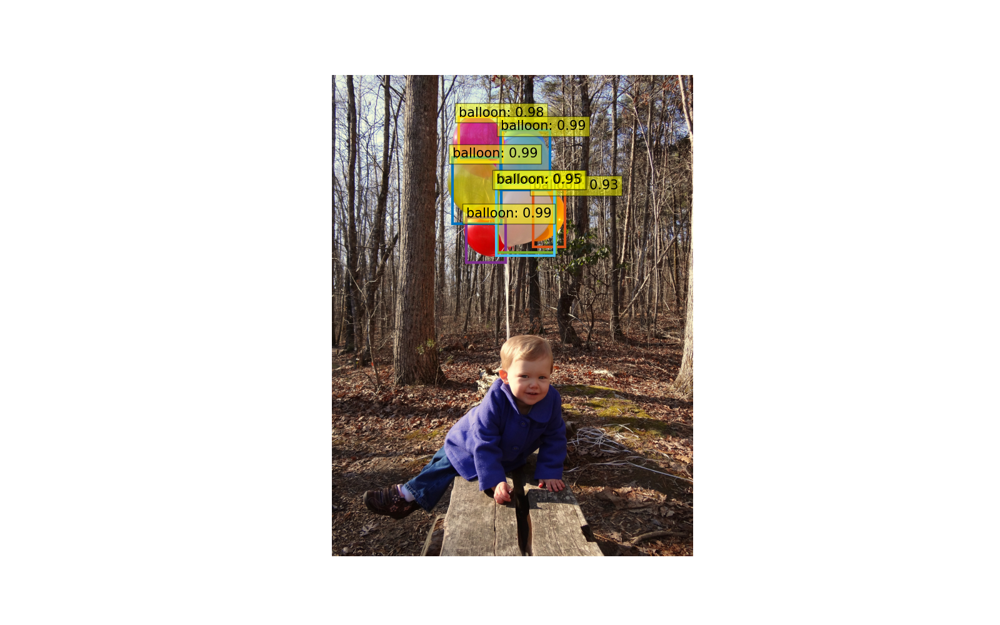
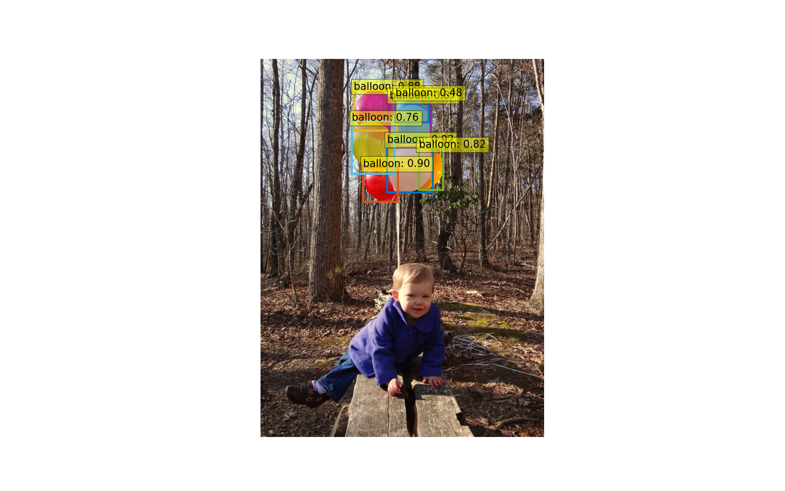
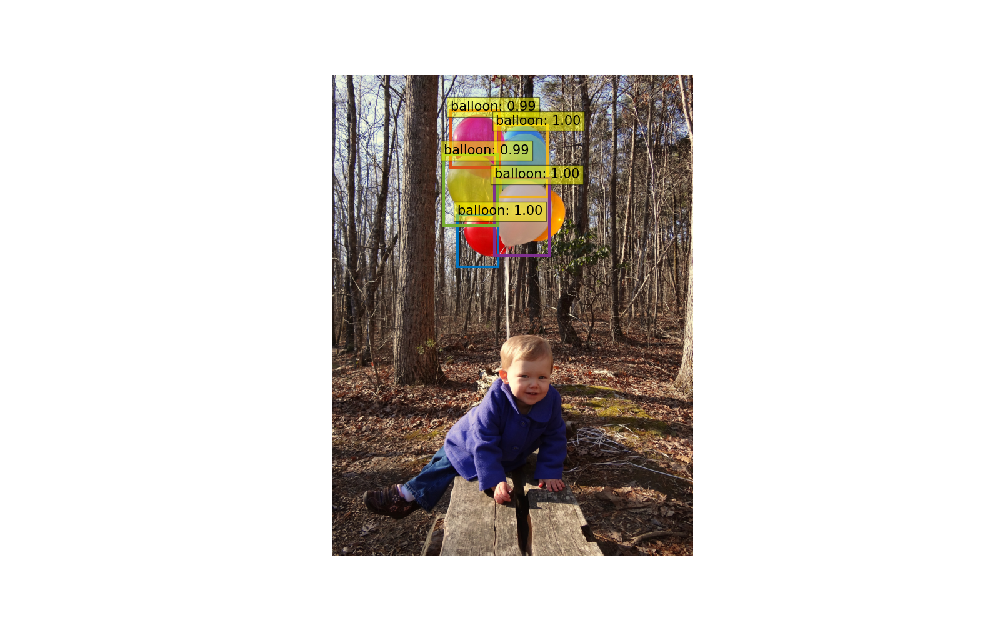

# Object Detection with Trasformer using Huggingface

## Dependencies
- Install Huggingface by following steps mentioned in [link](https://huggingface.co/docs/transformers/installation).
- pip install pytorch-lightning

## Dataset Preparation
  Ballon Dataset is converted to COCO format & present inside custom_balloon folder.

## Usage

### Training:

Currently Huggingface only supports following trasformer based object detection algorithm:

-   DETR
-   Conditional DETR
-   Deformable DETR
-   YOLOS

Run the below command for training

-   python3.8 training.py  --arch [detr|cond-detr|yolos|def-detr] --path model_output/[detr|cond-detr|yolos|def-detr] --epochs 5000 --profile True.

         --path model_output:  Use different folder for different architecture.

### Profiling

### Inference:

Run the below command

python3.8 inference.py --model model_out/detr  --arch detr/cond-detr/yolos/def-detr

Evaluation time with different model is as follows:

-   Evaluation Time for arch: detr is 762.916088104248 ms.
-   Evaluation Time for arch: yolos is 384.78732109069824 ms.
-   Evaluation Time for arch: cond-detr is 776.5250205993652 ms.
-   Evaluation Time for arch: def-detr is 2585.845708847046 ms.

### Output:

#### Original Image:

#### DETR Output:

#### Cond-DETR Output:

#### Deformable DETR Output:

#### YOLOS Output:

## Conclusion
In the original image, only 7 balloons are present and it was detected correctly with Cond-Detr & Def-Detr.

Detr model able to predict only 6 balloons & misses 1 prediction.Yolos is able to predict only 5 balloons &

misses 2 predictions.However,Yolos is the fastest architecture among all,whereas Def-Detr takes longer time 
than others.(Note: All the models were trained for 500 epochs).

So there is a clear trade-off between accuracy & speed.Please check the profiling data mentioned above.

Accuracy can be improved by finetuning the hyper parameters or with more training.

But the clear winner in terms of speed is Yolos & in terms of accuracy it's Cond-Detr & Def-Detr.

## References:

-   https://huggingface.co/docs/transformers/tasks/image_classification.
-   https://github.com/NielsRogge/Transformers-Tutorials.
-   https://arxiv.org/pdf/2005.12872.
-   https://arxiv.org/abs/2010.04159.
-   https://arxiv.org/pdf/2108.06152.
-   https://arxiv.org/pdf/2106.00666.
-   https://arxiv.org/pdf/2106.08322.
-   https://arxiv.org/abs/2202.09048.
-   https://arxiv.org/abs/2111.14330.

---
Reach me @

[LinkedIn](https://www.linkedin.com/in/satya1507/) [GitHub](https://github.com/satya15july) [Medium](https://medium.com/@satya15july_11937)
